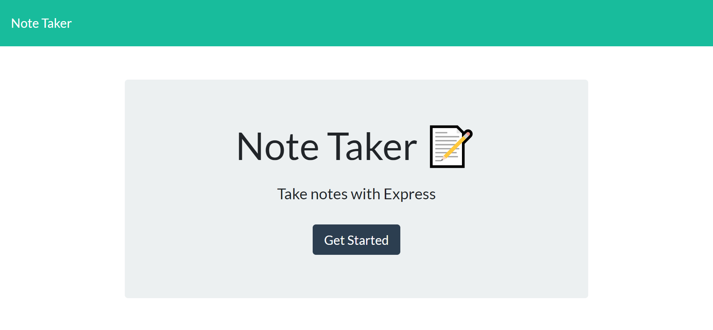
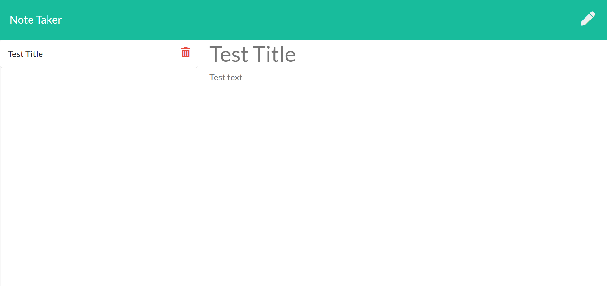
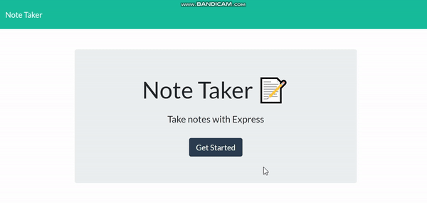
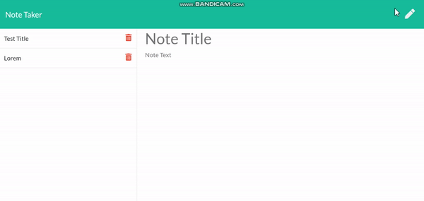
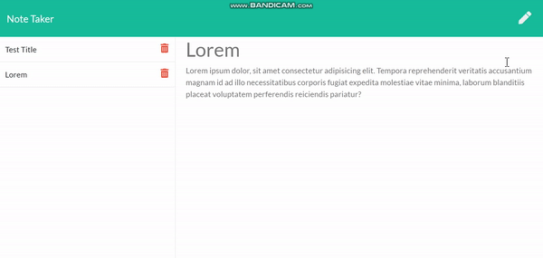

# Unit 11 Express Homework: Note Taker
[](https://opensource.org/licenses/MIT)

### Project Description
```md
* A sample Note taker application that can help the user write, save, and delete the notes
* The servers is deployed on Heroku
* Every note inculded `Title` and `Text`
```
1. `Home Page`



2. `Note Taker Page`



### Usage
1. Press `save` button to save the notes



2. All saved note will display title on the right column



3. Press `delete` button to delete the notes



### Language
```md
* HTML
* Javascrpit
* Node.js
* Express.js
```

## About
* Note taker: https://homework11notetaker.herokuapp.com/
* Project Github: https://github.com/DanielYu0864/DanielYu-HomeWork-11-Note-Taker
* Author: [`DanielYu0864`](https://github.com/DanielYu0864)

## Questions
*  For more question please contact me: adam741963@gmail.com

- - -
© 2020 - UW Coding Bootcamp Homework 11 Note Taker by Daniel Yu
